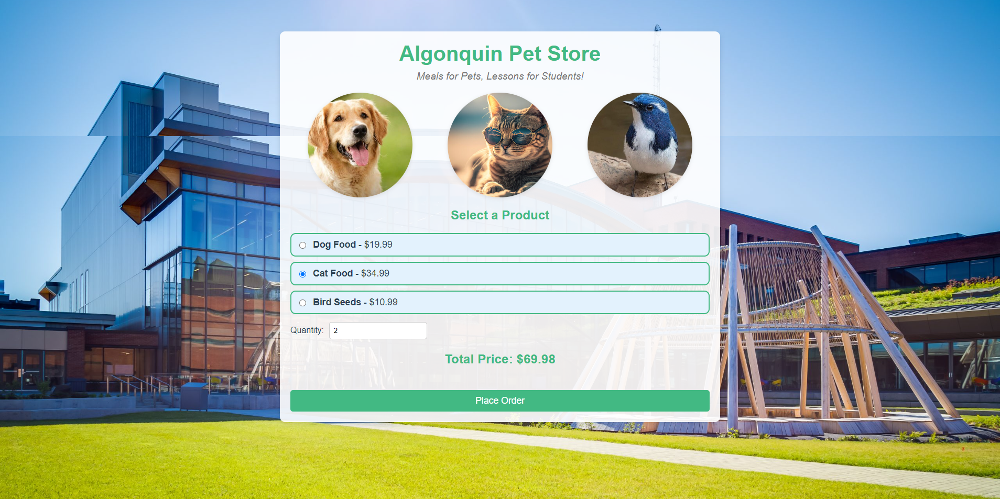
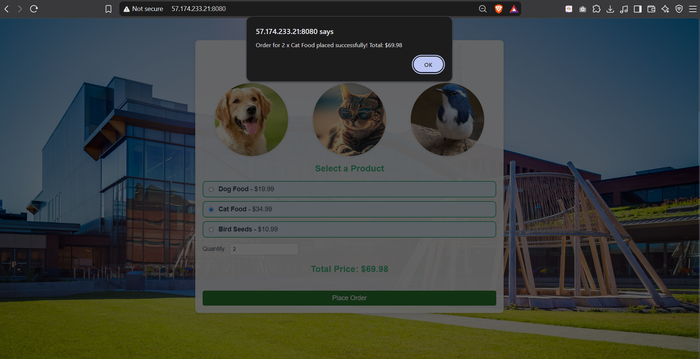
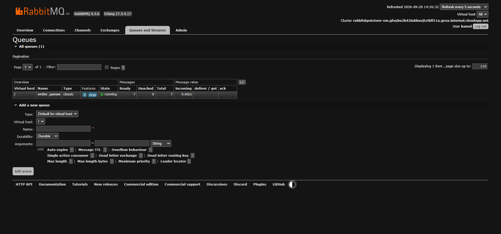

# CST8915 Lab 1: Algonquin Pet Store on Azure VM

- **Student Name :** Krami Kamal
- **Student ID :** 041273436
- **Course :** CST8915 Full-stack Cloud-native Development
- **Semester :** Fall 2026

## Demo Video

🎥 [Watch Demo Video](https://youtu.be/s_83MPjODSI)

## Technical Explanations

### Order Service (Node.js) :

The Order Service receives customer orders from the Store Front on port 3000. Instead of processing the order itself, it sends the order as a message to RabbitMQ, where it waits in a queue called `order_queue`. This way, the order is saved safely even if nothing is ready to process it yet.

It is written in Node.js, which works well for services that mostly receive requests and pass data along. In the architecture, it is the producer of messages. It talks to the Store Front through a REST API and to RabbitMQ through the AMQP protocol on port 5672.

### Product Service (Rust) :

The Product Service provides the product catalog: the ID, name, and price of each product. The Store Front calls it on port 3030 (`/products`) to show the products on the page. It does not depend on any other service.

It is written in Rust, a fast and memory-safe language, which is a good choice for a small API that only returns data. In the architecture, it is an independent service that can be started or changed without affecting the others.

### Store Front (Vue.js) :

The Store Front is the website that customers use. It shows the products, lets the user choose a product and a quantity, displays the total price, and sends the order. It runs on port 8080.

It is built with Vue.js, a JavaScript framework for building interactive web pages. It connects the other services together: it gets the products from the Product Service (port 3030) and sends orders to the Order Service (port 3000). Since it runs in the user's browser, it uses the VM's public IP address to reach these services.

## Screenshots

**Store Front** (products loaded from the Product Service) :

**Order confirmation** (after placing an order) :

**RabbitMQ** (`order_queue` with queued messages) :

## Challenges and Learnings

- **SSH key permissions :** SSH refused my `.pem` key at first because other Windows accounts could read it. I moved it to `C:\Users\<me>\.ssh\` and fixed its permissions.

- **VM running out of memory :** My first VM only had 1 GiB of RAM, so it froze when I used VS Code Remote-SSH. I learned that a bigger VM size is needed for remote development.
- **RabbitMQ management page not loading :** The plugin name was written with a hyphen (`rabbitmq-management`) instead of an underscore (`rabbitmq_management`). After fixing it, the page worked.
- **Network Security Group :** After recreating the VM, I had to attach the NSG to the VM's network interface so the ports (8080, 3000, 3030, 15672) were open.

## Acknowledgments

- CST8915 Lab 1 instructions provided by the course

## References
 
- [RabbitMQ Documentation](https://www.rabbitmq.com/docs)
- [Azure Network Security Groups Overview](https://learn.microsoft.com/en-us/azure/virtual-network/network-security-groups-overview)
- [VS Code Remote Development using SSH](https://code.visualstudio.com/docs/remote/ssh)